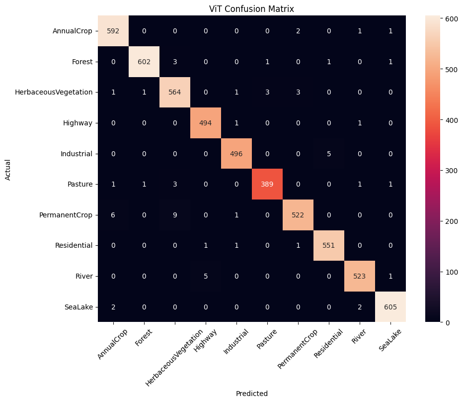
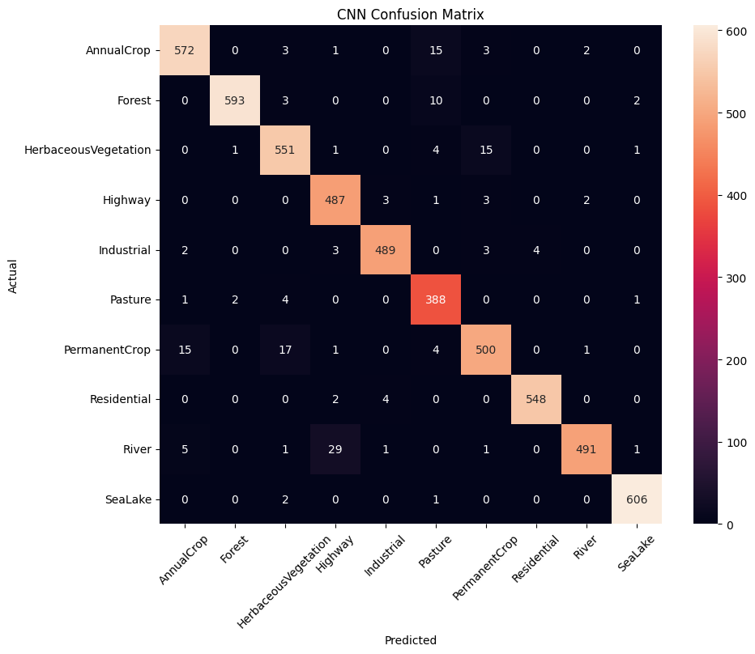
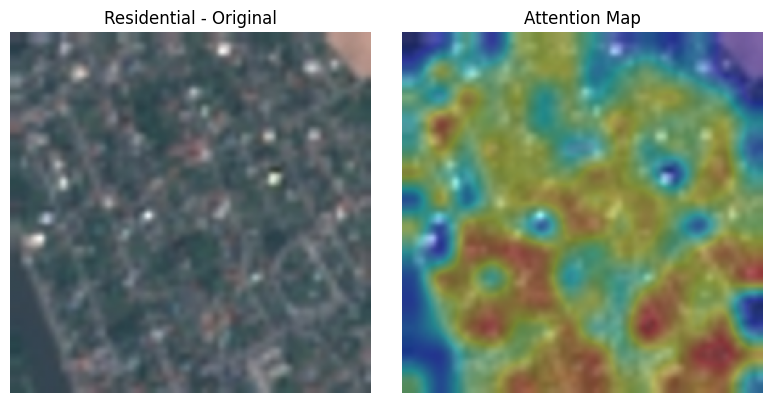
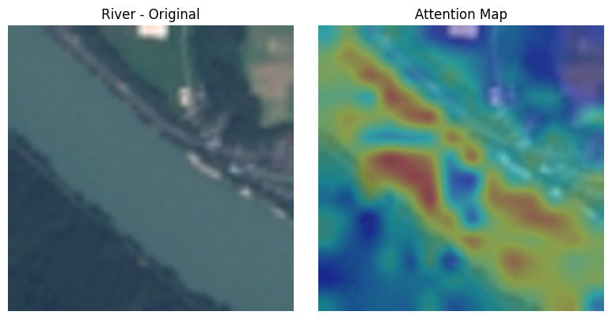
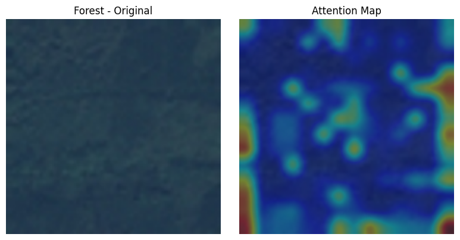

# CNN vs Vision Transformer on EuroSAT Satellite Imagery

Benchmarking ResNet18 (CNN) against Vision Transformer (ViT) on satellite image land-use classification. Both models are trained on the EuroSAT dataset and evaluated on the same test split.

---

## Dataset

[EuroSAT](https://github.com/phelber/EuroSAT) — 27,000 RGB satellite images at 64×64 resolution across 10 land-use classes.

| Class | Class |
|---|---|
| AnnualCrop | HerbaceousVegetation |
| Forest | Highway |
| Industrial | Pasture |
| PermanentCrop | Residential |
| River | SeaLake |

**Split:** 16,200 train / 5,400 validation / 5,400 test

---

## Models

### Vision Transformer (ViT)
- Architecture: `google/vit-base-patch16-224-in21k`
- Pretrained on: ImageNet-21k (14M images, 21k classes)
- Input resolution: 224×224 (upscaled from native 64×64)
- Fine-tuned for 5 epochs using HuggingFace Trainer

### ResNet18 (CNN)
- Architecture: `torchvision.models.resnet18`
- Pretrained on: ImageNet-1k (1.2M images, 1k classes)
- Input resolution: 64×64 (native resolution)
- Fine-tuned for 5 epochs using custom PyTorch training loop

---

## Results

| Model | Test Accuracy | Training Time |
|---|---|---|
| ViT (Vision Transformer) | **98.85%** | 35 min 31 sec |
| ResNet18 (CNN) | 96.76% | 4 min 17 sec |

**ViT is 2.09% more accurate but takes ~8x longer to train.**

### Per-class metrics

| Metric | ViT | CNN |
|---|---|---|
| Accuracy | 98.85% | 96.76% |
| Precision | 98.86% | 96.62% |
| Recall | 98.83% | 96.76% |
| F1-score | 98.84% | 96.66% |

---

## Confusion Matrix
| ViT Confusion Matrix | CNN Confusion Matrix |
|---|---|
|  |  |

**Key observations:**
- Near-perfect diagonal across all 10 classes
- Hardest class: **PermanentCrop** — confused with AnnualCrop and HerbaceousVegetation. Both are crop types that look visually similar from satellite altitude
- **River confused with Highway** — both are long, thin linear structures; a genuinely hard distinction even for human annotators
- Easiest classes: **SeaLake, Forest, AnnualCrop** — visually distinctive spectral signatures

---

## Attention Maps

Visualizing which image patches the ViT attends to when classifying each scene.

| Residential | River | Forest |
|---|---|---|
|  |  |  |

The model correctly focuses on building structures for Residential, linear water features for River, and dense canopy texture for Forest.

---

## Limitations

This is not a perfectly controlled comparison. Three confounding factors exist between the two models:

1. **Pretraining data** — ViT was pretrained on ImageNet-21k (14M images) vs ResNet18 on ImageNet-1k (1.2M images). ViT had ~10x more pretraining exposure.
2. **Input resolution** — ViT received upscaled 224×224 inputs while CNN used native 64×64. Higher resolution gives ViT an information advantage.
3. **Model capacity** — ViT-base has ~86M parameters vs ResNet18's ~11M. ViT has ~8x more capacity.

A fully controlled comparison would use models of equal size pretrained on identical data at the same resolution. This is noted as future work.

---

## Setup

```bash
pip install torch torchvision transformers datasets evaluate timm scikit-learn opencv-python
```

---

## Hardware

Trained locally on **NVIDIA RTX 4050 Laptop GPU (6GB VRAM)** — no cloud compute used.

---

## References

- [An Image is Worth 16x16 Words — Dosovitskiy et al. (2020)](https://arxiv.org/abs/2010.11929)
- [EuroSAT: A Novel Dataset and Deep Learning Benchmark — Helber et al. (2019)](https://arxiv.org/abs/1709.00029)
- [HuggingFace Transformers](https://huggingface.co/docs/transformers)
